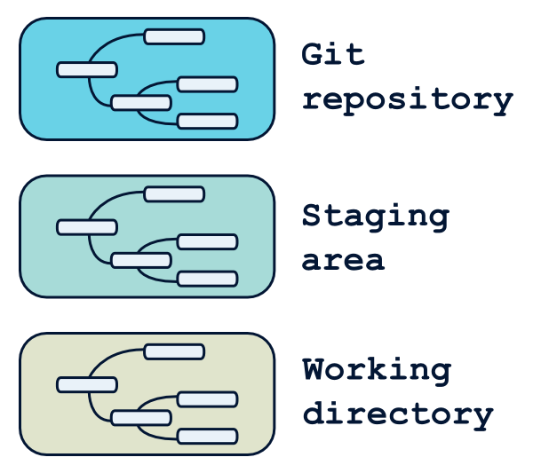
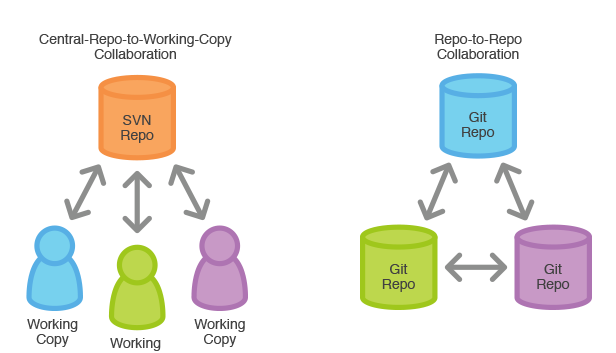

# GIT


## What's GIT

* Decentralized version control system
* Created by Linus Torvald in 2005
* Used to track linux source code


## Why GIT

* Keep records of your changes
* Allow collaborative development
* Find who made changes and when
* Revert any changes to previous state


# Local GIT


## Who are you

```
git config --global user.name "Your Name"
git config --global user.email "your@mail.foo"
```


## Create new repository

```
$ git init
```
```
Initialized empty Git repository in ./.git/
```


## Get repository status

```
$ git status
```
```
On branch master

Initial commit

nothing to commit (create/copy files
                           and use "git add" to track)
```


## Zones




## Why a staging area

* What's a good commit
  * only about one thing
  * smallest but coherent
* Why staging help
  * allow to work on multiple change
  * do separate commit from one workdir


## Workflow


## GIT ADD

* Copy file from working directory to staging
* If adding a directory, copy is recursive

```
$ git add myfile.txt
$ git status
```
```
On branch master

Initial commit

Changes to be committed:
  (use "git rm --cached <file>..." to unstage)

        new file:   myfile.txt
```


## GIT COMMIT

Save staging changes to repository as a commit

```
$ git commit -m "Add myfile.txt"
```
```
[master (root-commit) 3eecd13] Add myfile.txt
 1 file changed, 0 insertions(+), 0 deletions(-)
 create mode 100644 myfile.txt
```


## COMMIT HISTORY

```
$ git log
```
```
commit 75e78feb787de80f17693f0d0a6a675f72ca1b8b
Author: Your Name <you@example.com>
Date:   Thu Oct 12 13:14:34 2017 +0000

    Add myfile.txt
```


## COMMIT CONTENT

```
$ git show 847938d8f48c6a381e9212a91b472545935220c7
```
```
Author: Your Name <you@example.com>
Date:   Thu Oct 12 13:27:47 2017 +0000

    Add hello message

diff --git a/myfile.txt b/myfile.txt
index e69de29..cd08755 100644
--- a/myfile.txt
+++ b/myfile.txt
@@ -0,0 +1 @@
+Hello world!
```


## REVERT CHANGE

Working directory change
```
$ git checkout myfile.txt
```

Staging area change
```
$ git reset myfile.txt
```

Revert to previous commit
```
$ git revert bf832c69bf6aa488f292524aab4cf62f219c61b0
```


## Gitignore

* Force git to ignore files
* **.gitignore** at git root

```
# Compiled files
*.tfstate
*.tfstate.backup

# Module directory
.terraform/
terraform.tfstate.d/
```


# BRANCHES / TAGS


## References

* chain of commits
* branches / tags are references
* HEAD point to current reference
* master is default branch


## Create Branch

* create a new reference

```
$ git branch iss53
```


## Create Branch

* switch HEAD ref to a branch

```
$ git branch iss53
```

* create and switch to a new branch

```
$ git checkout -b iss53
```

* list branches

```
$ git branch
```


## Work on branches

* normal git workflow


## Merge

* apply diff from one branch to another
* create a new commit with two ancestors


## Merge

* switch to branch you wish to merge into

```
$ git checkout master
```

* merge branch to current one

```
$ git merge iss53
```


## Conflicts

* Git try to resolve automatically
* Else whe have to do manual resolution

```
<?php
<<<<<<< HEAD
        echo "tata";
=======
        echo "titi";
>>>>>>> 05ad020ca4d641797f42cb107967662c4d9e7e1f
?>
```


## Delete

* once merged we can delete branch

```
$ git branch -d iss53
```


## Tags

* like a branch that doesn’t change
* useful to track release versions


## Tags

* create tag

```
$ git tag v0.1.2
```

* list tags

```
$ git tag
```


# REMOTE GIT


## Distributed




## Clone existing repo

* Create a local repo
* Import remote repo history
* SSH authentication

```
$ git clone git@gitlab.com:sandbox/test.git
```


## Import local repo

```
$ git remote add origin \
          git@gitlab.com:sandbox/test.git
```


## Push local commits to repo

First push (create remote tracking)
```
$ git push -u origin master
```

Next pushes
```
$ git push
```


## Pull commits

* Download new remote commits
* Try to automatically merge

```
$ git pull
```


## Remote branches

* Push a local branch to remote repo

```
$ git -u origin localbranch
```

* List remote branches

```
$ git branch -a
```

* Checkout remote branch

```
$ git checkout remotebranch
```


# Questions ?
