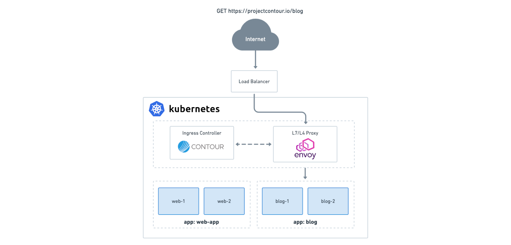

## Kubernetes


## Présentation

* Plateforme open source de gestion de conteneurs
* Kubernetes vient du grec "kubernētēs": "pilote"
* Développé à l'origine par Google, publié en 2014
* Inspiré par les pratiques internes de Google
* Confiée à la CNCF


## Présentation

* +35k stars sur Github
* Croissance rapide et continue
* Standard de l'industrie
* Communauté dynamique et engagée
* ~3 versions par an


## CNCF

* Organisation à but non lucratif qui vise à promouvoir l'adoption du cloud-native computing
* Gardien de Kubernetes et gestion du projet
* Ressources et expertise pour aider la communauté
* Porte l'écosystème Kubernetes: [Landscape](https://landscape.cncf.io/card-mode)


## Roadmap

* Définie par la communauté et continuellement MAJ
* Fonctionnalités, optimisations, sécurité
* Intégrée en fonction de la priorité et maturité


## Avantages

* Gestion efficace des containers sur le cloud
* Facilite le déploiement, le scaling et les MAJs
* Fonctions avancées:
  - self-healing
  - load-balancing
  - rolling update
* Compatibilité multi-cloud


## Inconvénients

* Une courbe d'apprentissage élevée
* Une complexité accrue de configuration et gestion
* Une dépendance à la HA des composants clés (API...)
* Coût plus élevé de mise en place et maintenance


## Concepts


## Architecture

* **Node** : machines physiques ou VM
* Les différents composants sont organisés en une architecture à deux niveaux 
  - nodes masters
  - nodes workers


## Node masters

* Nodes principaux du cluster
* Responsables de la gestion de l'ensemble du cluster
* Exécutent les composants de contrôle
* Composants sytème:
  - API server
  - etcd
  - kube-controller-manager
  - kube-scheduler


## Node Workers

* Nodes qui exécutent les workloads (applicatifs)
* Exécution des pods et des conteneurs
* Composants sytème:
  - kubelet
  - kube-proxy
  - container runtime


## Composants masters

* **API server**
  - point unique de communication entre composants
  - point communication avec les clients
* **Etcd**:
  - Base de données distribuée
  - Stocke l'état du cluster
* **kube-controller-manager**:
  - gère les différents contrôleurs Kubernetes
* **kube-scheduler**: 
  - affecte les pods aux nodes
  - en fonction des ressources disponibles


## Composants workers

* **kubelet**: agent qui parle à l'API et démarre les pods
* **kube-proxy**: gère les règles de réseau (services)
* **Container runtime**: docker, containerd...


## Configuration YAML

* Configuration en YAML
* Sensible (très) aux indentations
* **Metadata**: name, labels, annotations
* **Spec**: configuration de l'objet

```
---
apiVersion: VERSION_API_TYPE_OBJET
kind: TYPE_OBJET
metadata:
  name: NOM_OBJET
  labels:
    mon_label: ma_valeur
spec:
  containers:
  - name: MON_CONTAINER
    image: MON_IMAGE
```


## Concepts clés

* **Namespace**
* **Container**
* **Pod**
* **Deployment**
* **Service**
* **Labels**
* **Annotations**


## Namespaces

* Diviser un cluster en sous-ensembles logiques
* Organiser et isoler les ressources
* Contient les objets Kubernetes:
  - pods
  - deployment
  - services
  - ...


## Containers

* Container Docker (containerd)
* Executés via le Kubelet sur les masters et workers
* Ne peuvent pas être déployés directement


## Pods

* Plus petite unité de déploiement
* Contient un ou plusieurs conteneurs
* Partagent le même espace de réseau et de stockage
* Ephémères: créés, supprimés ou remplacés en fonction des besoins
* Non déplaçables


## Pods (config)

* Fichier YAML

```
---
apiVersion: v1
kind: Pod
metadata:
  name: nginx-pod
spec:
  containers:
  - name: nginx
    image: nginx
```


## Deployments

* Définir l'état souhaité d'un ensemble de pod et le maintenir
* Templates de pod avec nombre de replicas et spécifications
* Gestion des updates, rollback et scaling


## Deployments (config)

```
---
apiVersion: apps/v1
kind: Deployment
metadata:
  name: nginx-deployment
spec:
  selector:
    matchLabels:
      app: nginx-label
  replicas: 2
  template:
    metadata:
      name: nginx-pod
      labels:
        app: nginx-label
    spec:
      containers:
      - name: nginx
        image: nginx
        ports:
        - containerPort: 80
```


## Services

* Permet de faire correspondre une adresse IP fixe à un ensemble de pods
* Equivalent d'un loadbalancer
* Equilibre la charge entre les pods
* Teste la santé des pods


## Services (config)

```
---
apiVersion: v1
kind: Service
metadata:
  name: nginx-service
spec:
  selector:
    app: nginx-label
  ports:
  - protocol: TCP
    port: 80
    targetPort: 80
```


## Labels

* Paires clé-valeur attachées aux objets
* Filtrer et de sélectionner des objets
* Utilisés par les deployments et services


## Annotations

* Métadonnées supplémentaires attachées aux objets
* Ajout de configuration pour les controllers

```
metadata:
  name: nginx-service
  annotations:
    dns.alpha.kubernetes.io/external: "svc.kops.mycorp.fr"
```


## Installation


## Installation

* Complexe en raison du grand nombre de composants
* Outils d'installation: kubeadm, kOps ou Rancher
* Services managés: GKE, EKS ou AKS


## kOps

* Gestion du cycle de vie des clusters sur le cloud
* Fichiers YAML pour décrire l'état souhaité du cluster
* Prend en charge:
  - plusieurs versions de Kubernetes
  - des composants supplémentaires: metricsServer, cert-manager...


## Étapes d'installation

1. Configuration de l'environnement AWS
1. Installation de kOps
1. Création de la configuration du cluster
1. Création du cluster Kubernetes
1. Vérification du cluster


## Création de la configuration

```
export KOPS_CLUSTER_NAME=mycluster.kops.mycompany.fr
export KOPS_STATE_STORE=s3://kops-mycompany-state
```

```
kops create cluster \
    --cloud=aws --zones=eu-west-1a,eu-west-1b \
    --master-count=1 --master-size=t3.small \
    --node-count=2 --node-size=t3.small \
    --networking=calico \
    --ssh-public-key ~/.ssh/id_rsa.pub \
    --discovery-store=s3://kops-mycompany-oidc-store/mycluster/discovery
```


## Exemple de fichier de configuration

```
apiVersion: kops.k8s.io/v1alpha2
kind: Cluster
metadata:
  name: my-cluster.example.com
spec:
  channel: stable
  topology:
    dns:
      type: Public
    masters: public
    nodes: public
  networkCIDR: 10.0.0.0/16
  subnets:
    - cidr: 10.0.0.0/24
      name: us-west-2a
      type: Public
      zone: us-west-2a
  sshKeyName: my-keypair
```


## Création et validation du cluster

* Création du cluster à partir de la configuration

```
kops update cluster --yes --admin
```

* Attente de la validation du cluster

```
kops validate cluster --wait 10m
```


## TP 1 et 2

* Installation des outils:
  - kubectl
  - kubens
  - kops
  - cli aws
* Création du cluster


## Kubectl

* Outil CLI principal pour interagir avec les clusters
* Gérer les objets Kubernetes comme les pods...


## Kubectl (get)

* Lister les objets d'un type donné

```
kubectl get namespaces
kubectl get services
kubectl get pods -n kube-system
kubectl get deployments -n default
kubectl get events -w
```


## Kubens

* Changer de namespace courant

```
kubens kube-system
```


## Kubectl (describe)

* Informations détaillées sur un objets

```
kubectl describe pod my-pod
kubectl describe service my-service
kubectl describe deployment my-deployment
```


## Kubectl (create)

* Créer des objets simples comme les namespaces
* Sans configuration donc non compatible IaC

```
kubectl create namespace monapp
```


## Kubectl (apply)

* Créer ou mettre à jour des objets via fichier YAML
* Avec configuration donc compatible IaC
* Bonne pratique

```
kubectl apply -f deployment.yaml
```


## Kubectl (edit)

* Modifier des objets existants

```
kubectl edit pod my-pod
kubectl edit service my-service
kubectl edit deployment my-deployment
```


## Kubectl (delete)

* Supprimer des objets tels que des pods, services...

```
kubectl delete deployment nginx
```

* Supprimer l'ensemble des objets d'un fichier YAML

```
kubectl delete -f deployment.yaml
```


## Kubectl (logs)

* Récupérer les journaux d'un conteneur dans un pod
* Options pour le suivi en temps réel et les filtres

```
kubectl logs nginx-1234
```


## Kubectl (run)

* Créer rapidement un pod, par exemple pour debug
* Préciser l'image et la commande à lancer
* Peut être intéractif et temporaire

```
kubectl run --rm -it monpod --image=ubuntu bash
```


## Kubectl (exec)

* Exécuter une commande dans un container existant
* Conteneur spécifique dans un pod
* Peut être intéractif

```
kubectl exec my-pod -- ls /
kubectl exec -it my-pod -- bash
```


## TP 3-4-5-6


## Controllers


## aws-cloud-controller

* Intégration transparente des services AWS
* Gérer des ressources AWS:
  - EC2
  - disques EBS
  - security groups


## awsLoadBalancerController

* Gère les LoadBalancer AWS (ELB, ALB, NLB)
* Intégration avec les objets Service et Ingress
* Piloter via des annotations sur les objets Kubernetes


## cert-Manager

* Délivrance et la rotation automatique de certificats
* Certificats TLS (HTTPS) pour les ingress
* Compatible avec divers fournisseurs: Let's Encrypt, Vault...


## metrics Server

* Collecte les métriques de performance des ressources
* Utilisation du CPU et mémoire des pods et des nodes
* Utilisé par Cluster Autoscaler, HPA, VPA

```
kubectl top nodes
kubectl top pods
```


## TP 7 et 8


## Ingress

* Gère l'exposition de services HTTP(S) à l'exterieur
* Règles sur le nom de l'hôte et le chemin de l'URL
* Mise en commun des LoadBalancers externes
* Peut porter la terminaison SSL


## Ingress (config)

```
apiVersion: networking.k8s.io/v1
kind: Ingress
metadata:
  name: wordpress
spec:
  rules:
  - host: wordpress.kops.mycorp.fr
    http:
      paths:
      - path: /
        pathType: Prefix
        backend:
          service:
            name: wordpress
            port:
              number: 80
```


## Ingress Controller

* Controller chargé de lire les objets Ingress
* Reverse proxy configuré par le controller
* Abstraction de l'implémentation:
  - Nginx Ingress Controller
  - Contour Ingress Controller
  - Traefik Ingress Controller
  - Istio Ingress Gateway


## Contour

* Ingress Controller open source
* Donné à la CNCF par VMware
* Solution hautement configurable et sécurisée
* Utilise le reverse-proxy haute performance Envoy
* Déploiement simple via un fichier YAML


## Contour (architecture)




## Helm

+ network policy
+ volumes