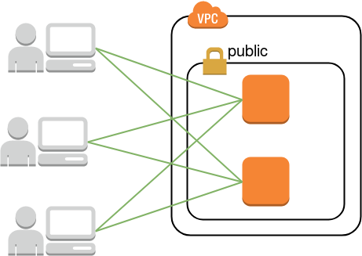
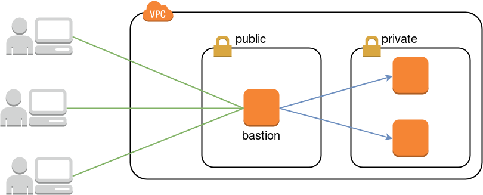
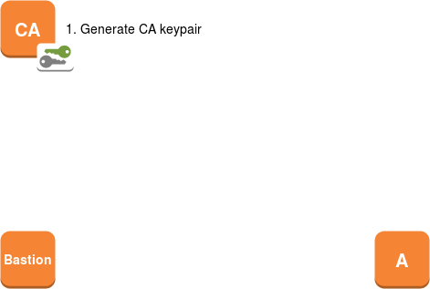
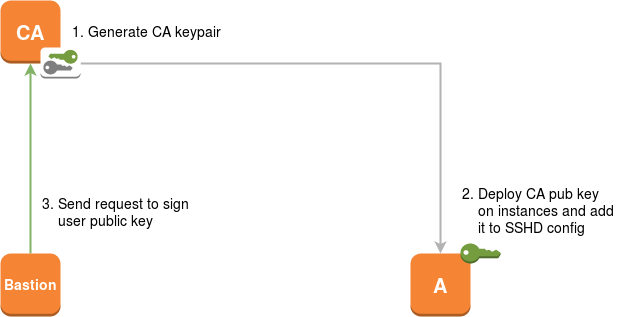
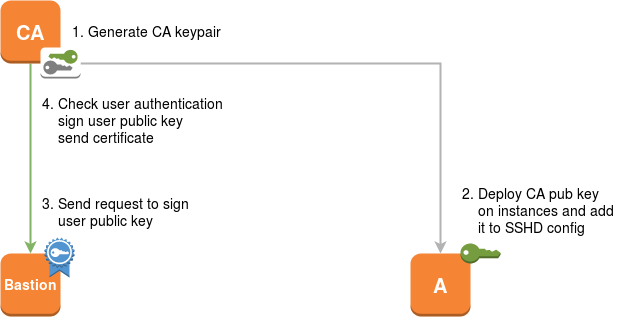
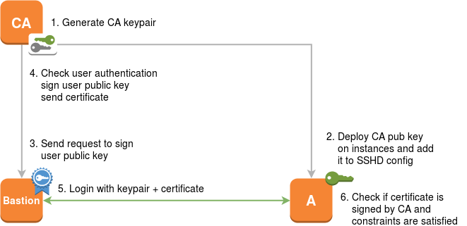

## SSH Certificate Authority


# Bastion


## Traditional access



## Access via bastion



## Why a bastion ?
* Expose only one ssh instance to internet
* Reduce firewalling complexity
* Central point to secure


## ProxyCommand

In *~/.ssh/config*: 

```
Host bastion  
  Hostname my-bastion-host.example.com

Host my_server  
  Hostname 10.0.1.18
  ProxyCommand ssh bastion -W %h:%p
```


## Jump

Since openssh 7.3 (august 2016):
```
Host my_server
  Hostname 10.0.1.18
  ProxyJump my-bastion-host.example.com
```


# Auth types


## Local users
* Couple of accounts with passwords
* Some sudo config
* Works well with a few servers


## LDAP
* Centralized management
* All servers needs to access the directory
* Local users on distant hosts
* Password at each connection


## Public key
* secure authentication (no bruteforce)
* no password prompt (after unlock)
* private keys can get lost, stolen or shared
* replacing a key means updating all your servers


## Public key @ Opera
[SKA - SSH Key Authority](https://github.com/operasoftware/ssh-key-authority)


# CA


## OpenSSH CA

* Introduced in [OpenSSH 5.4](https://lwn.net/Articles/377703/)
* Released in March 2010
* Available on all current distributions


## Used by

* Facebook
  * [Scalable and secure access with SSH](https://code.facebook.com/posts/365787980419535/scalable-and-secure-access-with-ssh)
* Netflix
  * [Bastion's Lambda Ephemeral SSH Service](https://github.com/Netflix/bless)
* Lyft
  * [Blessing your SSH at Lyft](https://eng.lyft.com/blessing-your-ssh-at-lyft-a1b38f81629d)


## Certificate Authority
* centralized management
* user friendly (as public key)
* deploying an automated signing system
* up to date inventory of authorized ssh keys


# CA Workflow














# Manage CA


## ssh-keygen
* generate CA
* sign certificates
* inspect certificates
* ...


## Generate CA
```bash
$ ssh-keygen -C CA -f ca
```
```bash
Generating public/private rsa key pair.
Your identification has been saved in ca.
Your public key has been saved in ca.pub.
The key fingerprint is:
SHA256:d7baaDPH74NfhFiG7aNj5wcQk2U+D+5lyJCTDhZCkKE CA
```


## Sign certificate
```bash
$ ssh-keygen -s ca -I pruth -n root -V +1w \
        -z 1 -O source-address=192.168.1.10 ~/.ssh/id_rsa.pub
```
```bash
Signed user key /home/pablo/.ssh/id_rsa-cert.pub:
  id "pruth" serial 1 for root
  valid from 2017-09-27T22:44:00 to 2017-10-04T22:45:25
```


## Inspect certificate
```bash
ssh-keygen -Lf ~/.ssh/id_rsa-cert.pub
```
```
Type: ssh-rsa-cert-v01@openssh.com user certificate
Public key: RSA-CERT SHA256:KRWXLaWFzX886qRiSXHLOf....
Signing CA: RSA SHA256:uuCZnmqibFaY7XATpK4I9cOlvbl....
Key ID: "pruth"
Serial: 1
Valid: from 2017-09-27T22:44:00 to 2017-10-04T22:45:25
Principals:
        root
Critical Options:
        source-address 192.168.1.10
Extensions:
        permit-X11-forwarding
        permit-port-forwarding
        permit-pty
        permit-user-rc
```


## Certificate type
* user certificate for signed public key
* host certificate for sshd server key pair

```
Type: ssh-rsa-cert-v01@openssh.com user certificate
```


## Key ID
* arbitrary name
* logged by SSHD

```
Key ID: "pruth"
```


## Validity period
```
Valid: from 2017-09-27T22:44:00 to 2017-10-04T22:45:25
```


## Critical options
* force use from bastion
* enforce authorized commands

```
Critical Options:
        source-address 192.168.1.10
        force-command /bin/date
```


## Extensions
```
Extensions:
        permit-X11-forwarding
        permit-port-forwarding
        permit-pty
        permit-user-rc
```


## Principals
* By default, allow to connect with this user
* Can be a list of hosts, applications, zones...
```
Principals:
        root
```


# Server config


## sshd_config

Set trusted CA
```
TrustedUserCAKeys /etc/ssh/ca.pub
```

Optionally set custom list of principals
```
AuthorizedPrincipalsFile /etc/ssh/authorized_principals
```


# Vault


## What is Vault

* A product from Hashicorp
* A tool for managing secrets
* Written in Go
* Single binary
* Current version 0.8.3 (28/09/2017)
* Actively developed
* +7000 stars on Github


## Vault goals

* Single source of secrets
* Programmatic application access
* Modern datacenter friendly (cloud)


## Key features

* Secure Secret Storage
* Dynamic Secrets
* Leasing, Renewal and Revocation
* Auditing
* Rich ACLs
* Multiple Client Authentication Methods


## Secure storage

* Data is encrypted in transit and at rest
* 256bit AES in GCM mode
* TLS 1.2 for clients


## Libraries

* Official
  * Go, Ruby
* Community
  * Java, NodeJS, PHP, Python...


## SSH CA

* CA keypair generation
* private half of signing key stays within Vault
* public half is exposed via the API
* each mount represents a unique signing key pair
* use different keys to sign hosts and clients


## Sign SSH keys

Mount SSH CA backend

```
$ vault mount ssh
```

Create CA keypair in Vault

```
$ vault write -f ssh/config/ca
```

Push public CA cert to SSH hosts

```
$ vault read -field=public_key ssh/config/ca > /etc/ssh/ca
```

Add *TrustedUserCAKeys* param to *sshd_config*

```
TrustedUserCAKeys /etc/ssh/ca
```


## Create role

Logical name that maps to a policy

```
vault write ssh-client-signer/roles/sign-user-role @clientrole.json
```

```
{
  "allow_user_certificates": true,
  "allowed_users": "*",
  "default_extensions": [
    {
      "no-agent-forwarding": "no"
    }
  ],
  "key_type": "ca",
  "default_user": "root",
  "ttl": "30m0s"
}
```


## Sign client keys

* Sign client cert *id_rsa.pub*
* Automatically detected by openssh in *id_rsa-cert.pub*
* Principals auth default to username

```
$ vault write \
  ssh/sign/sign-user-role 
  valid_principals=root
  ttl=1h
  public_key=-
```
