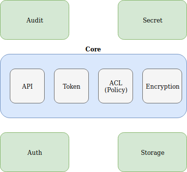

# VAULT


## Theoretical part


## What is Vault

* A tool for managing secrets
* A product from Hashicorp
* Written in Go
* Single binary
* Current version 1.12.2 (30/11/2022)
* Actively developed
* +26000 stars on Github


## Why Vault

* Secret sprawl
* Decentralized keys
* Limited visibility
* No "break glass" procedure


## Vault goals

* Single source of secrets
* Full auditing
* Programmatic access
* Modern datacenter friendly (cloud)


## Key features

* Secure Secret Storage
* Dynamic Secrets (PKI, SSH, AWS, ...)
* Leasing, Renewal and Revocation
* Auditing
* Rich ACLs
* Multiple Client Authentication Methods


## Secure storage

* Data is encrypted in transit and at rest
* 256bit AES in GCM mode
* TLS 1.2 for clients


## Libraries

* Official
  * Go, Ruby
* Community
  * Python, Java, NodeJS, PHP, ...


## Integrations

* Terraform
* Ansible
* Kubernetes
* AWS 
* ...


## Threat model


### In scope

* Eavesdropping on any Vault communication (client, storage backend)
* Tampering with data at rest or in transit
* Access to data or controls without authentication or authorization
* Access to data or controls without accountability
* Availability of secret material in the face of failure


### Out scope

* Protecting against arbitrary control of the storage backend
* Protecting against the leakage of the existence of secret material
* Protecting against memory analysis of a running Vault


## Architecture



## 4 types of backend


## Storage backend

> A storage backend represents the location for the durable storage of Vault's information.


## Storage backend

* Filesystem
* Integrated Storage (HA)
* Consul (HA)
* DynamoDB (HA)


## Auth backend

> Auth backends are the components in Vault that perform authentication and are responsible for assigning identity and a set of policies to a user.


## Auth backend

* Generic
  * token
* User oriented
  * User/Pass, LDAP, OIDC, ...
* Machine oriented
  * AppRole, Kubernetes, AWS EC2, ...
* [Full list](https://developer.hashicorp.com/vault/docs/auth)


## Secret backend

> Secret backends are the components in Vault which store and generate secrets. They behave very similarly to a virtual filesystem.


## Secret backend

* Generic
* PKI
* SSH
* AWS IAM
* [Full list](https://developer.hashicorp.com/vault/docs/secrets)


## Audit backend

> Audit backends are the components in Vault that keep a detailed log of all requests and response to Vault.


## Audit backend

* File
* Syslog


## Practical part


## Config file

Config file is minimal, all other params are set via API

```
storage "file" {
  path = "/mnt/vault/data"
}

listener "tcp" {
  address     = "127.0.0.1:8200"
  tls_disable = 1
}

ui = true
```


## Start Vault server
```
vault server -config=/etc/vault/config.hcl
```
```
==> Vault server configuration:

                     Cgo: disabled
              Go Version: go1.19.3
              Listener 1: tcp (addr: "127.0.0.1:8200", cluster address: "127.0.0.1:8201", max_request_duration: "1m30s", max_request_size: "33554432", tls: "disabled")
               Log Level: info
                   Mlock: supported: true, enabled: true
           Recovery Mode: false
                 Storage: file
                 Version: Vault v1.12.2, built 2022-11-23T12:53:46Z
             Version Sha: 415e1fe3118eebd5df6cb60d13defdc01aa17b03

==> Vault server started!
```


## Set server address

Set Vault address for CLI
```
export VAULT_ADDR="http://vault-server:8200"
```


## Get vault status

```
$ vault status
```
```
Key                Value
---                -----
Seal Type          shamir
Initialized        true
Sealed             true
Total Shares       2
Threshold          2
Unseal Progress    0/2
Unseal Nonce       n/a
Version            1.12.2
Build Date         2022-11-23T12:53:46Z
Storage Type       file
HA Enabled         false
```


## Initialization

* One-time operation
* Uses Shamir's secret sharing algorithm
* Split the master key into 5 shares (default)
* Threshold of 3 to reconstruct the master key (default)
* Master key is used to protect the encryption key


## Initialization


## Initialization

```
$ vault operator init -key-shares=2 -key-threshold=2
```
```
Unseal Key 1: KzD/kDk3Yi36oLoe/NEpO2hrj9JNzj7Hnt/HQZV3vGGI
Unseal Key 2: 63254v1iWYVMjTKN+NmAVszgvHI144dcIdaMvu9auBW2

Initial Root Token: hvs.c5Ru2hXKOuYJEzP62dgSH1tF
```


## Unseal

> Unsealing is the process of constructing the master key necessary to read the decryption key to decrypt the data, allowing access to the Vault.


## Unseal

* Needed each time a Vault server is restarted
* Vault starts in a sealed state
* Almost no operations are possible when sealed
* We need to unseal with threshold number of keys
* Can be automated when deployed on cloud provider (AWS KMS)


## Unseal

```
$ vault operator unseal
```
```
Key                Value
---                -----
Seal Type          shamir
Sealed             true
Total Shares       2
Threshold          2
Unseal Progress    1/2
Unseal Nonce       0b2b953b-826b-2b66-4f59-791cabd43c4f
```
```
$ vault operator unseal
```
```
Key             Value
---             -----
Seal Type       shamir
Sealed          false
Total Shares    2
Threshold       2
```


## Seal

* Throw away the master key
* Only requires a single operator with root privileges
* Data can be locked quickly to try to minimize damage


## Seal

```
$ vault operator seal
```
```
Vault is now sealed.
```


## Authentication


## Token

* Core of client authentication
* Enabled by default at */auth/token*
* Every authentication method generate a token
* Token stored in *~/.vault-token* after auth


## Token

```
$ vault login
Token (will be hidden): 
```
```
Success! You are now authenticated. The token information displayed below
is already stored in the token helper. You do NOT need to run "vault login"
again. Future Vault requests will automatically use this token.

Key                  Value
---                  -----
token                hvs.c5Ru2hXKOuYJEzP62dgSH1tF
token_accessor       5nSipCdigv8oNJ3ERgNeMM5y
token_duration       ∞
token_renewable      false
token_policies       ["root"]
identity_policies    []
policies             ["root"]
```


## Root tokens

* Special root token mapped to root policy
* Root token can do anything in Vault
* Only used for just enough initial setup
* Generate new root token with quorum unseal keys


## Token Hierarchies

* new tokens created as children of the original token
* parent token revoked, all of its child tokens revoked
* orphan token with others authentication backends


## LDAP

* user-oriented
* using an existing LDAP credentials
* mapping of groups and users to policies


## LDAP

```
$ vault login -method=ldap username="my_ldap_user"
Password (will be hidden): 
```
```
Success! You are now authenticated. The token information displayed below
is already stored in the token helper. You do NOT need to run "vault login"
again. Future Vault requests will automatically use this token.

Key                    Value
---                    -----
token                  hvs.CAESIBvxGS3kdMNg7vgj_ny7JQJd4Ad85IMN4NJ9GOJMfQhzGh4KHGh2cy5ydm41WGFtWG9LckNRQzluVnpuZVlQbHo
token_accessor         JtY2aeS0J89GLghzqItroM6f
token_duration         12h
token_renewable        true
token_policies         ["default" "policy-vault-admin"]
identity_policies      []
policies               ["default" "policy-vault-admin"]
token_meta_username    my_ldap_user
```


## AppRoles

* machine-oriented
* set of Vault policies and login constraints
* RoleID
* SecretID
* CIDR list


## Kubernetes

* Pods avec access to service account JWT token
* Call Kubernetes Review API
* Bound role only on specific service account and namespace


## Basic CLI


## Wrapper for REST requests

* API: [Documentation](https://developer.hashicorp.com/vault/api-docs)
* CRUD operations matching REST verbs


## List mounted secret backends
```
$ vault secrets list
```
```
Path          Type         Accessor              Description
----          ----         --------              -----------
cubbyhole/    cubbyhole    cubbyhole_8ea9b5c2    per-token private secret storage
identity/     identity     identity_9273abbc     identity store
secret/       kv           kv_0ffc4d2b           key/value secret storage
sys/          system       system_672f0123       system endpoints used for control, policy and debugging
```


## Write data
On CLI
```
$ vault write cubbyhole/password value=itsasecret
```

With CURL
```
$ curl -X POST -H "X-Vault-Token: $TOKEN" \
    $VAULT_ADDR/v1/cubbyhole/password -d '{"value":"itsasecret"}'
```


## List keys
On CLI
```
$ vault list cubbyhole/
```
```
Keys
----
password
```

With CURL
```
$ curl -X LIST -H "X-Vault-Token: $TOKEN" \
    $VAULT_ADDR/v1/cubbyhole/
```
```
{"request_id":"51ac4e13-d6bd-c5d9-126b-08530cd93c2d","lease_id":"","renewable":false,"lease_duration":0,"data":{"keys":["password"]},"wrap_info":null,"warnings":null,"auth":null}
```


## Read data
On CLI
```
$ vault read cubbyhole/password
```
```
Key                 Value
---                 -----
refresh_interval    768h0m0s
value               itsasecret
```

With CURL
```
$ curl -X GET -H "X-Vault-Token: $TOKEN" \
    $VAULT_ADDR/v1/cubbyhole/password
```
```
{"request_id":"e040721f-2be5-0ae6-e1b0-f36f7b45bdb8","lease_id":"","renewable":false,"lease_duration":0,"data":{"value":"itsasecret"},"wrap_info":null,"warnings":null,"auth":null}
```


## Delete data
On CLI
```
$ vault delete cubbyhole/password
```
```
Success! Data deleted (if it existed) at: cubbyhole/password
```

With CURL
```
$ curl -X DELETE -H "X-Vault-Token: $TOKEN" \
      $VAULT_ADDR/v1/cubbyhole/password
```


## Call other API path

Commands can be used for any API call

Ex for AppRole login:
```
vault write auth/approle/login \
    role_id=efe401fb-xxxx-xxxx-xxxx-xxxxxxxxxxxx \
    secret_id=af4cf7d8-xxxx-xxxx-xxxx-xxxxxxxxxxxx
```
```
Key                     Value
---                     -----
token                   hvs.CAESIC7WTY0xxxxxxxxxxxxxxxxxxxxxxxxxxxxxxxxxxxxxxxxxxxxxxx
token_accessor          CwPaJ9xxxxxxxxxxxxx
token_duration          10h
token_renewable         true
token_policies          ["default" "approle-myapp-policy"]
identity_policies       []
policies                ["default" "approle-myapp-policy"]
token_meta_role_name    myapp
```


## Generic secret backend v2

* Like KV1 but with versioning
* Specific API path
  * data (read, write, delete specific version)
  * metadata (list, versions, delete key+versions)
* Specific vault CLI commands


## Write data on KV2

* Create secret if it doesn't exist
* Create a new version of secret if it exist


## Write data on KV2
On CLI
```
$ vault kv put kv/folder/password value=itsasecret
```
```
===== Secret Path =====
kv/data/folder/password

======= Metadata =======
Key                Value
---                -----
created_time       2023-01-26T14:09:37.061548012Z
custom_metadata    <nil>
deletion_time      n/a
destroyed          false
version            1
```


## Write data on KV2

With CURL
```
$ curl -X POST -H "X-Vault-Token: $TOKEN" \
    $VAULT_ADDR/v1/kv/data/folder/password \
    -d '{"data":{"value":"itsasecret"}}'
```
```
{
  "request_id": "f2fb5675-4e07-25bf-45df-3a56188a7613",
  "lease_id": "",
  "renewable": false,
  "lease_duration": 0,
  "data": {
    "created_time": "2023-01-26T14:10:40.759415379Z",
    "custom_metadata": null,
    "deletion_time": "",
    "destroyed": false,
    "version": 2
  },
  "wrap_info": null,
  "warnings": null,
  "auth": null
}
```


## Read data on KV2

* Read latest version by default
* Can specify a version


## Read data on KV2

On CLI
```
$ vault kv get -version=1 kv/folder/password
```
```
===== Secret Path =====
kv/data/folder/password

======= Metadata =======
Key                Value
---                -----
created_time       2023-01-26T14:10:35.975915498Z
custom_metadata    <nil>
deletion_time      n/a
destroyed          false
version            1

==== Data ====
Key      Value
---      -----
value    itsasecret
```


## Read data on KV2

With CURL
```
curl -X GET -H "X-Vault-Token: $TOKEN" \
  $VAULT_ADDR/v1/kv/data/folder/password?version=1 
```
```
{
  "request_id": "1730fee5-34ec-bafb-44ca-7462e4cffa34",
  "lease_id": "",
  "renewable": false,
  "lease_duration": 0,
  "data": {
    "data": {
      "value": "itsasecret"
    },
    "metadata": {
      "created_time": "2023-01-26T14:10:35.975915498Z",
      "custom_metadata": null,
      "deletion_time": "",
      "destroyed": false,
      "version": 1
    }
  },
  "wrap_info": null,
  "warnings": null,
  "auth": null
}
```


## Delete data on KV2

* Delete latest version
```
vault kv delete kv/folder/password
```
```
Data deleted at: kv/data/folder/password
```

* Delete key and all versions
```
vault kv metadata delete kv/folder/password
```
```
Data deleted at: kv/metadata/folder/password
```


## Delete data on KV2

With CURL
```
curl -X DELETE -H "X-Vault-Token: $TOKEN" \
  $VAULT_ADDR/v1/kv/metadata/folder/secret
```


## Audit

* File, syslog or socket
* Log every single action in Vault

```
$ vault audit enable file file_path=/var/log/vault_audit.log
```


## Authorization


## ACL

* ACLs are applied to paths
  * secret/*
  * secret/app
* Deny by default
* Most specific ACL is used


## Capabilities

* Fine-grained control over operations
  * create (POST/PUT)
  * read (GET)
  * update (POST/PUT)
  * delete (DELETE)
  * list (LIST)
  * sudo (root-protected paths)
  * deny


## Policy

Group of ACLs

```
# Full subpath
path "secret/*" {
  capabilities = ["read", "create", "update", "delete", "list"]
}

# Specific path only
path "secret/app/db" {
  capabilities = ["read"]
}

# System path
path "auth/token/lookup-self" {
  capabilities = ["read"]
}
```


## Policy

KV2 ACLs

```
# Data access
path "kv/data/folder/subfolder/*" {
  capabilities = ["create", "update", "read"]
}

# Delete last version
path "kv/data/folder/subfolder/*" {
  capabilities = ["delete"]
}

# List keys, delete key + all versions
path "kv/metadata/folder/subfolder/*" {
  capabilities = ["list", "delete"]
}
```


## Policy

Import a policy in Vault

```
$ vault policy write secret secret.hcl
```

Apply a policy to LDAP group
```
$ vault write auth/ldap/groups/myldapgroup policies=secret
```


## HA


## Integrated Storage

* Storage without external backend (Consul, Etcd, ...)
* Raft election
* Raft log to store data
* Uniq node_id and cluster_addr

```
backend "raft" {
  path = "/projet/data/vault/"
  node_id = "q1vault01"
}

cluster_addr = "https://q1vault01.ouest-france.fr:8201"
api_addr = "https://lb.ouest-france.fr:8200"
```


## List peers

```
vault operator raft list-peers
```
```
Node     Address                   State       Voter
----     -------                   -----       -----
node1    node1.vault.local:8201    follower    true
node2    node2.vault.local:8201    follower    true
node3    node3.vault.local:8201    leader      true
```


## Join peer

```
vault operator raft join https://node1.vault.local:8200
```


# Disaster recovery


## Backup

* Snapshot Vault raft log to file

```
vault operator raft snapshot save backup.snap
```


## Restore

* Bring cluster online reinitialized
* Copy raft snapshot file
* Restore snapshot from file

```
vault operator raft snapshot restore -force backup.snap
```
* Unseal Vault with existing unseal keys


## PKI


## PKI secret backend

* generate or import and store CA
* generates X.509 certificates dynamically
* services can get certificates without manual process
* one CA == one backend
* built-in support for CRL


## Init CA

Mount backend

```
$ vault mount pki
```

Generate or import CA

```
$ vault write interalca/root/generate/internal \
        common_name=internalca ttl=87600h
```


## Create a role

Logical name that maps to a policy

```
$ vault write internalca/roles/example-fr \
    allowed_domains="example.fr" \
    allow_subdomains="true" max_ttl="72h"
```


## Issue a certificate

* Generate a private/public keys
* Emit CSR
* Sign certificate
* Output all datas as JSON

```
$ vault write internalca/issue/example-fr \
                        common_name=test.example.fr
```