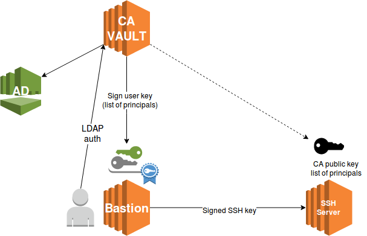

# VAULT


## What is Vault

* A tool for managing secrets
* A product from Hashicorp
* Written in Go
* Single binary
* Current version 0.10.1 (26/04/2018)
* Actively developed
* +9000 stars on Github


## Why Vault

* Secret sprawl
* Decentralized keys
* Limited visibility
* No "break glass" procedure


## Vault goals

* Single source of secrets
* Full auditing
* Programmatic access
* Modern datacenter friendly (cloud)


## Key features

* Secure Secret Storage
* Dynamic Secrets
* Leasing, Renewal and Revocation
* Auditing
* Rich ACLs
* Multiple Client Authentication Methods


## Secure storage

* Data is encrypted in transit and at rest
* 256bit AES in GCM mode
* TLS 1.2 for clients


## Libraries

* Official
  * Go, Ruby
* Community
  * Java, NodeJS, PHP, Python...


## Integrations

* Ansible
* Terraform
* Consul-template
* Confd
* AWS 
* Docker


## Basic CLI


## Env

Set Vault address for CLI
```
export VAULT_ADDR="http://vault-server:8200"
```


## Get vault status

```
$ vault status
```
```
Sealed: false
Key Shares: 5
Key Threshold: 3
Unseal Progress: 0
Unseal Nonce: 
Version: 0.10.0
Cluster Name: vault-cluster-c209a2b2
Cluster ID: 95fd6576-9e55-52b9-5c6f-017f57fbbeab

High-Availability Enabled: false
```


## List mounted secret backends
```
$ vault secrets mount
```
```
Path        Type       Default TTL  Max TTL  Force No Cache  Replication Behavior  Description
cubbyhole/  cubbyhole  n/a          n/a      false           local                 per-token private secret storage
secret/     generic    system       system   false           replicated            generic secret storage
sys/        system     n/a          n/a      false           replicated            system endpoints used for control, policy and debugging
```


## Generic secret backend

* store arbitrary secrets
* mounted by default at *secret/*
* arborescence like a virtual filesystem
* CRUD operations
* Writing to a key will replace the old value


## Write data
On CLI
```
$ vault write secret/password value=itsasecret
```

From file
```
$ vault write secret/password @data.json
```


## List keys
```
$ vault list secret
```
```
Keys
----
password
```


## Read data
Get data + metadata
```
$ vault read secret/password
```
```
Key                 Value
---                 -----
refresh_interval    768h0m0s
value               itsasecret
```
Get only selected key
```
$ vault read -field=value secret/password
```
```
itsasecret
```


## Delete data
```
$ vault delete secret/password
```
```
Success! Deleted 'secret/password' if it existed.
```


## Mount secret backend
If path is not specified, default to backend name
```
$ vault secrets enable -path=/anothergenericbackend generic
```
```
Successfully mounted 'generic' at '/anothergenericbackend'!
```


## Architecture


## 4 types of backend


## Storage backend

> A storage backend represents the location for the durable storage of Vault's information.


## Storage backend

* Filesystem
* Consul (HA)
* S3
* DynamoDB (HA)
* Mysql


## Auth backend

> Auth backends are the components in Vault that perform authentication and are responsible for assigning identity and a set of policies to a user.


## Auth backend

* Generic
  * token
* User oriented
  * User/Pass, LDAP, Github
* Machine oriented
  * AppRole, AWS EC2, Kubernetes


## Secret backend

> Secret backends are the components in Vault which store and generate secrets. They behave very similarly to a virtual filesystem.


## Secret backend

* Generic
* Transit
* AWS IAM
* Cassandra
* PKI
* SSH


## Audit backend

> Audit backends are the components in Vault that keep a detailed log of all requests and response to Vault.


## Audit backend

* File
* Syslog


## Threat model


### In scope

* Eavesdropping on any Vault communication (client, storage backend)
* Tampering with data at rest or in transit
* Access to data or controls without authentication or authorization
* Access to data or controls without accountability
* Availability of secret material in the face of failure


### Out scope

* Protecting against arbitrary control of the storage backend
* Protecting against the leakage of the existence of secret material
* Protecting against memory analysis of a running Vault


## Config file

Config file is minimal, all other params are set via API

```
backend "file" {

    path = "/srv/vault"

}

listener "tcp" {

    address = "0.0.0.0:8200"
    tls_disable = "true"

}
```


## Start Vault server

```
vault server -config=/etc/vault/config.hcl
```
```
==> Vault server configuration:

                     Cgo: disabled
              Listener 1: tcp (addr: "0.0.0.0:8200", cluster address: "0.0.0.0:8201", tls: "disabled")
               Log Level: info
                   Mlock: supported: true, enabled: true
                 Storage: file
                 Version: Vault v0.10.0
             Version Sha: 614deacfca3f3b7162bbf30a36d6fc7362cd47f0
```


## Initialization

* Uses Shamir's secret sharing algorithm
* Split the master key into 5 shares
* Threshold of 3 to reconstruct the master key
* Master key is used to protect the encryption key


## Initialization


## Initialization

```
$ vault init
```
```
Unseal Key 1: 6kGTk+gIEz8PyNGsx/TWSm/8yKQdn/qcmsJG1SO4RM8B
Unseal Key 2: 3F2MaXjCrDfdr6RhKQgY5DcFxZOatHDFXq5XS49rcHkC
Unseal Key 3: IAo452DivgYFxHb6JyLIfhNL1Z/si1M46py7rCbMTgkD
Unseal Key 4: PTknIi15Ugtx/jZsz1eY1GNrFlLmOwE9wqSzRqtzrbAE
Unseal Key 5: wW6TrDVZQDqpleT3wX1ITkclBl6QBCLAdpZfoQLUk8AF
Initial Root Token: 16e8ea9e-ebac-53ad-4043-22a5e9c610d2
```


## Initialization

We can use PGP to protect unseal keys

```
$ vault init -key-shares=3 -key-threshold=2 \
             -pgp-keys="jeff.asc,vishal.asc,seth.asc"
```


## Unseal

> Unsealing is the process of constructing the master key necessary to read the decryption key to decrypt the data, allowing access to the Vault.


## Unseal

* Vault starts in a sealed state
* Almost no operations are possible when sealed
* We need to unseal with threshold number of keys


## Unseal

```
$ vault operator unseal
Key (will be hidden): 
```
```
Sealed: true
Key Shares: 5
Key Threshold: 3
Unseal Progress: 1
Unseal Nonce: 04130de4-08d5-8dc0-d0c9-684c2cb3cc18
```
```
$ vault operator unseal
Key (will be hidden): 
```
```
Sealed: false
Key Shares: 5
Key Threshold: 3
Unseal Progress: 0
```


## Seal

* Throw away the master key
* Only requires a single operator with root privileges
* Data can be locked quickly to try to minimize damage


## Seal

```
$ vault operator seal
```
```
Vault is now sealed.
```


## Authentication


## Token

* Core of client authentication
* Enabled by default at */auth/token*
* Every authentication method generate a token
* Token stored in *~/.vault-token* after auth


## Token

```
$ vault login
Token (will be hidden):
```
```
Successfully authenticated! You are now logged in.
token: 16e8ea9e-ebac-53ad-4043-22a5e9c610d2
token_duration: 0
token_policies: [root]
```


## Root tokens

* Special root token mapped to root policy
* Root token can do anything in Vault
* Only used for just enough initial setup
* Generate new root token with quorum unseal keys


## Token Hierarchies

* new tokens created as children of the original token
* parent token revoked, all of its child tokens revoked
* orphan token with others authentication backends


## Userpass

* user-oriented
* username and password combination
* local accounts


## LDAP

* user-oriented
* using an existing LDAP credentials
* mapping of groups and users to policies


## AppRoles

* machine-oriented
* set of Vault policies and login constraints
* RoleID
* SecretID
* CIDR list


## AWS EC2

* EC2 instances have access to metadata
* AWS also provides PKCS#7 signature
* AWS public keys used to verify the signature
* verifies the running status of the instance
* Trust On First Use (TOFU) with instance ID
* bind tags and/or AMI id to Vault policies


## Audit

* File or syslog
* Log every single action in Vault

```
$ vault audit enable file file_path=/var/log/vault_audit.log
```


## Authorization


## ACL

* ACLs are applied to paths
  * secret/*
  * secret/app
* Deny by default
* Most specific ACL is used


## Capabilities

* Fine-grained control over operations
  * create
  * read
  * update
  * delete
  * list
  * sudo
  * deny


## Policy

Group of ACLs to applied to users

```
path "secret/*" {
  capabilities = ["read", "create", "update", "delete", "list"]
}

path "secret/app/db" {
  capabilities = ["read"]
}

path "auth/token/lookup-self" {
  capabilities = ["read"]
}
```


## Policy

Import a policy in Vault

```
$ vault policy write secret secret.hcl
```

Apply a policy to LDAP group
```
$ vault write auth/ldap/groups/myldapgroup policies=secret
```


## PKI


## PKI secret backend

* generate or import and store CA
* generates X.509 certificates dynamically
* services can get certificates without manual process
* one CA == one backend
* built-in support for CRL


## Init CA

Mount backend

```
$ vault mount pki
```

Generate or import CA

```
$ vault write interalca/root/generate/internal \
        common_name=internalca ttl=87600h
```


## Create a role

Logical name that maps to a policy

```
$ vault write internalca/roles/example-fr \
    allowed_domains="example.fr" \
    allow_subdomains="true" max_ttl="72h"
```


## Issue a certificate

* Generate a private/public keys
* Emit CSR
* Sign certificate
* Output all datas as JSON

```
$ vault write internalca/issue/example-fr \
                        common_name=test.example.fr
```


## SSH


## One-Time-Password

* issue an OTP every time a client wants to SSH
* remote host ask vault for verification 
* vault helper for client/server
* very detailed audit


## SSH CA

* Certificate authority for ssh
* Can sign client and host keys
* Openssh feature since 5.6 (08/2010)


## CA architecture




## SSH CA

* Used by big companies (Facebook, Netflix, ...)
* Scalable
  * No need for hosts to talk with CA
* Single point of trust
* Precise right management
* Detailed audit


## SSH CA

* CA signing key is generated
* private half of signing key stays within Vault
* public half is exposed via the API
* each mount represents a unique signing key pair
* use different keys to sign hosts and clients


## Sign client keys

Mount SSH CA backend

```
$ vault mount -path ssh-client-signer ssh
```

Create CA keypair in Vault

```
$ vault write -f ssh-client-signer/config/ca
```

Push public CA cert to SSH hosts

```
$ vault read -field=public_key ssh/config/ca > /etc/ssh/ca.pem
```

Add *TrustedUserCAKeys* param to *sshd_config*

```
TrustedUserCAKeys /etc/ssh/ca.pem
```


## Create role

Logical name that maps to a policy

```
vault write ssh-client-signer/roles/sign-user-role @clientrole.json
```

```
{
  "allow_user_certificates": true,
  "allowed_users": "*",
  "default_extensions": [
    {
      "no-agent-forwarding": "no"
    }
  ],
  "key_type": "ca",
  "default_user": "root",
  "ttl": "30m0s"
}
```


## Sign client keys

* Sign client cert *id_rsa.pub*
* Automatically detected by openssh in *id_rsa-cert.pub*
* Principals auth default to username

```
$ vault write \
  ssh/sign/sign-user-role 
  valid_principals=root
  ttl=1h
  public_key=-
```


## Display certificate

```
$ ssh-keygen -Lf id_ecdsa-cert.pub
id_ecdsa-cert.pub:
  Type: ecdsa-sha2-nistp256-cert-v01@openssh.com user certificate
  Public key: ECDSA-CERT ...
  Signing CA: ECDSA ...
  Key ID: "pruth"
  Serial: 1
  Valid: from 2017-04-13T15:26:00 to 2017-04-20T15:27:00
  Principals:
    root
  Critical Options: (none)
  Extensions:
    permit-X11-forwarding
    permit-agent-forwarding
```


## Advanced principals

Allow arbitrary list of principals (zones) in *sshd_config*

```
AuthorizedPrincipalsFile /etc/ssh/auth_principals/%u
```

```
$ echo -e 'zone-webservers\nroot-everywhere' > \
                      /etc/ssh/auth_principals/root
```


## Response Wrapping


## Cubbyhole secret backend

* mounted at the *cubbyhole/* prefix
* cannot be mounted elsewhere or removed
* paths are scoped per token
* allow response wrapping


## Wrapping

* original response is serialized to JSON
* new single-use token is generated
* original response JSON is stored in the single-use token's cubbyhole
* new response is generated, with the token ID
* new response is returned to the caller


## Wrapping

Ask vault to wrap the response in a token

```
$ vault read -wrap-ttl="1m" secret/hello
```
```
Key                             Value
---                             -----
wrapping_token:                 c67e2c39-37d6-6bca-4759-32db53425c2a
wrapping_token_ttl:             1m0s
wrapping_token_creation_time:   2017-04-26 11:48:08.727174793 +0000 UTC
```


## Unwrapping

* read to sys/wrapping/unwrap with wrapping token ID
* original value will be returned
* if original response is an authentication, token's accessor will be made available


## Unwrapping

Ask vault to unwrap the token

```
$ vault unwrap c67e2c39-37d6-6bca-4759-32db53425c2a
```
```
Key                     Value
---                     -----
refresh_interval        768h0m0s
value                   world
```


## Wrapping / Unwrapping

A token is single-use

```
$ vault unwrap c67e2c39-37d6-6bca-4759-32db53425c2a
```
```
Error making API request.

URL: PUT http://vault-server:8200/v1/sys/wrapping/unwrap
Code: 400. Errors:

* wrapping token is not valid or does not exist
```


## Production


## HA Backend

* Consul cluster


## HA Archi


## TLS certificates

Add TLS to API
```
listener "tcp" {

  address = "0.0.0.0:8200"
  tls_cert_file = "/etc/vault/vault.crt"
  tls_key_file  = "/etc/vault/vault.key"

}
```


## Ephemeral root tokens

* No root token after init
* Create and revoke when necessary


## Key rotation

* Encryption key rotation
* Master key rotation